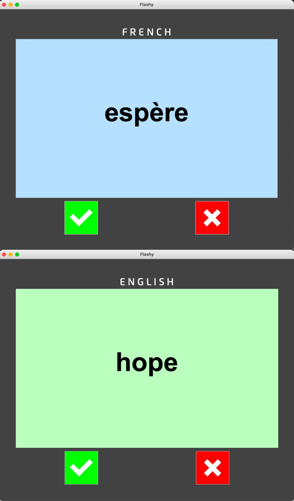

## flash cards

### description:

flash_cards is designed to help you learn something. In this case its French. The words to learn are kept in '
data/french_words'.
 The French word is displayed first and then after three seconds the English word is displayed.

If you got the answer correct, click the green button, else click the red button.
The known words are removed from the
list of words and the remaining words are saved to 'data/words_to_learn.csv'
 

### screenshot

